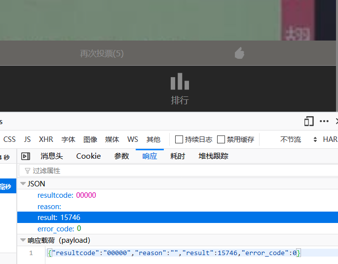

[TITLE]:if(已关注){投票()}else{alert('请关注')}
[TAGS]:技术

> 记一次WEB投票应用的安全审计

一个礼拜前，在卫生系统工作的一个高中同学发给我一个比赛的链接让我投票，好吧，又是微信投票。一般来说不是特别关系我投都懒得投，但高中同学的投票我历来是不会拒绝的。   
确认安全打开后,唉?怎么还要关注公众号?作为一个很讨厌关注公众号的人,我把链接扔到了PC上，开始看看有没有某种不关注也可以投票的方法。。。

#### 一、前端代码的逻辑
首先当然是右键查看源代码,开始代码审计,在网页代码的按钮事件绑定里就发现了这么一段有趣的代码,就是像标题伪代码那样的逻辑判断代码(因为懒,没截图,直到比赛结束三天后的今天想去截图已经晚了,整个比赛网站早删除掉了..)

一般来说,这样的逻辑判断都是服务器自己完成然后再返回结果给浏览器的,这是防止有人为了跳过IF判断直接在控制台执行`投票()`从而进行的一个安全开发的规范方法,显然这个网站的开发人员并不在乎什么安全.  
不过考虑到这个网站是在比赛之后就立即删掉的情况,我也就不吐槽开发网站的人了.  
直接F12打开控制台执行投票函数  


哎呀,还真的成功了呢

#### 二、刷票
既然成功了,那么我们是不是可以... ...嘿嘿... ...  
好吧,同学说了他们有防刷票系统,刷票会被拦截,抓到的话她就完了.  

来来,让我来看看是什么防刷票系统...
```
(本段过程因作者太懒没写)
```

结果就是一个WAF开启了浏览器、IP和MAC监测, 我是说怎么没拦截到我呢  
哼,小儿科~

#### 三、安全开发设计规范
我都不想说什么了..  
## 安全开发!安全开发!安全开发!
## 遵守规范!遵守规范!遵守规范!

重要的事情说几遍你们也不会听是吧?早晚出大事!

此文终结.

**(刷票这种违法犯罪的事我才不会去做呢!)**

最后还是恭喜高中同学荣获"最受市民欢迎奖"~