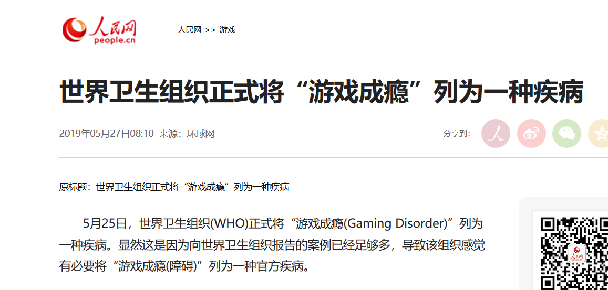

[TITLE]:游戏成瘾=疾病!
[TAGS]:随笔

> 5月25日，世界卫生组织(WHO)正式将“游戏成瘾(Gaming Disorder)”列为一种疾病。

六年前的2013年5月, 我发了一篇《网瘾=精神病（X2）》，而几天前，我在人民网上看到了这则新闻：  

万万没想到这个梗我能玩十一年... ...哈哈哈哈哈哈

*********
([相关新闻链接](http://game.people.com.cn/n1/2019/0527/c40130-31103923.html))